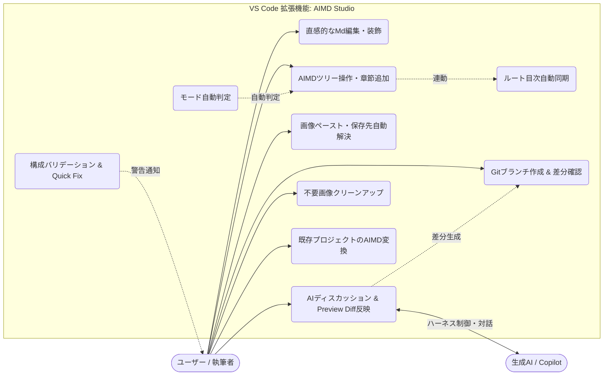
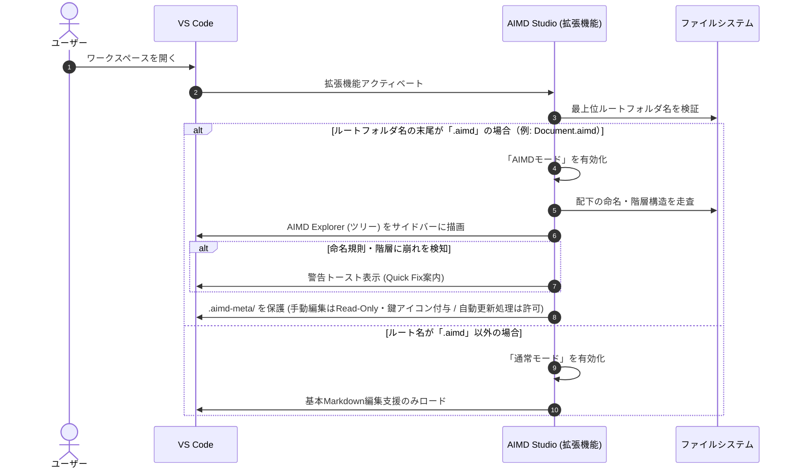
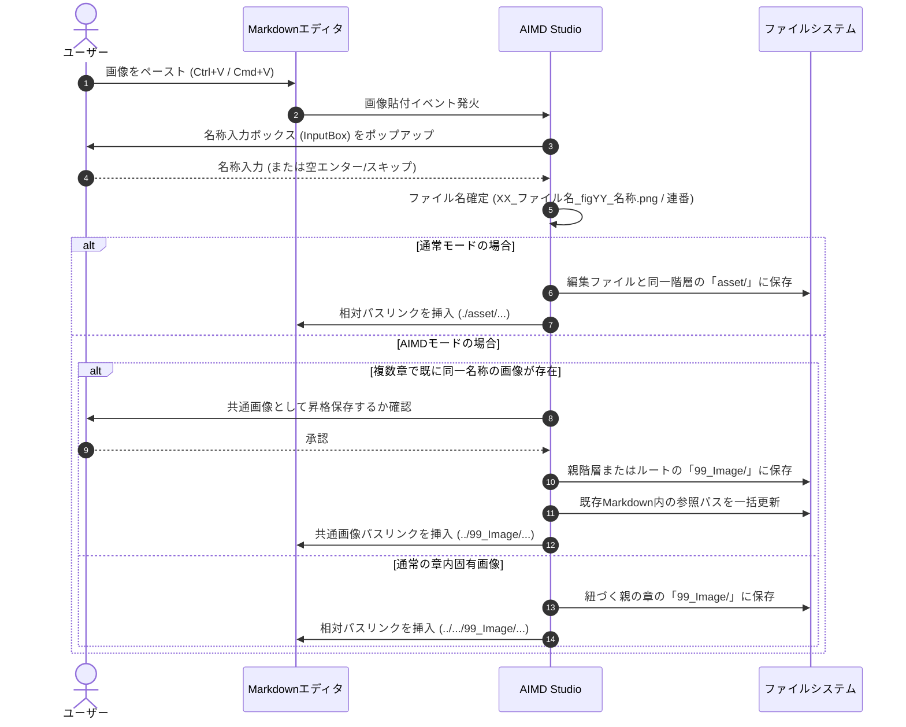
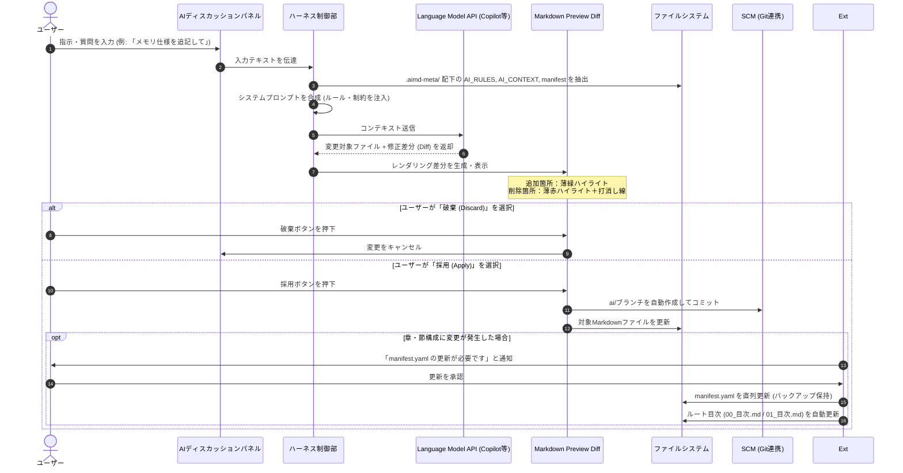
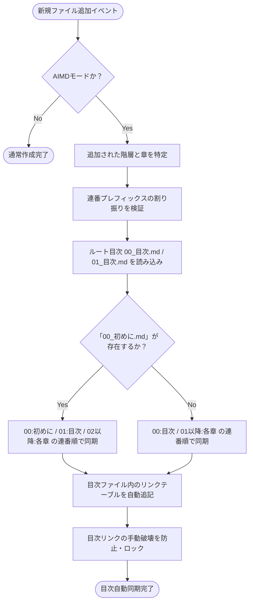
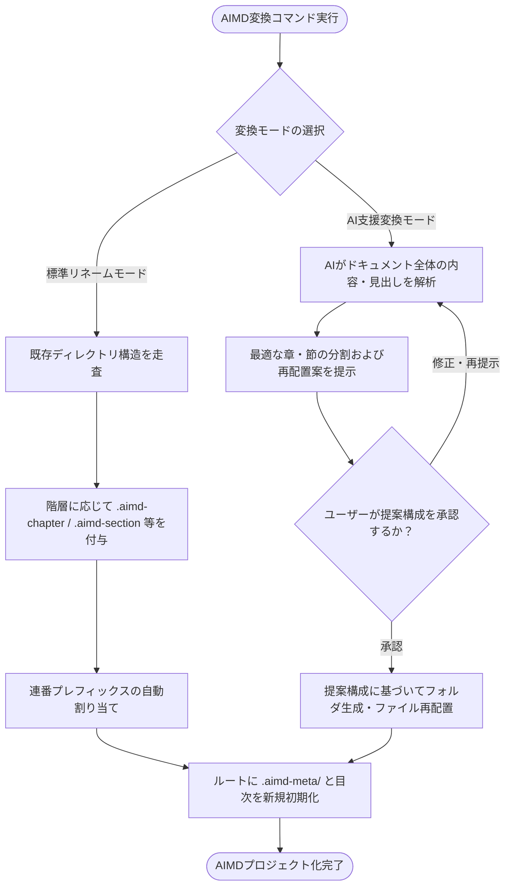

# パート2: VS Code 拡張機能「AIMD Studio」要件定義書

---

## 1. 概要・動作モード判定

ワークスペース最上位フォルダ名の末尾（`.aimd`）を自動検知し、エディタの動作モードを切り替えます。

| モード | 判定条件 | 動作概要 | 主な有効機能 |
| :--- | :--- | :--- | :--- |
| **AIMDモード** | ルートフォルダ名が `.aimd` | 構造化ドキュメント編集に特化した完全支援モード | ・AIMD Explorer（専用ツリー） ・階層別専用アイコン表示 ・メタデータ（`.aimd-meta/`）保護 ・ルート目次（`00_目次.md` / `01_目次.md`）自動同期・保護 ・章ごとの画像自動保存・共通化解決 ・構成バリデーション（Quick Fix） ・ハーネスAI連携（Preview Diff） |
| **通常モード** | ルート名が `.aimd` 以外 | 単一Markdownファイルの作成・執筆を快適にする軽量支援モード | ・スマート改行処理 ・スタイルコントロールパネル ・スラッシュコマンド（`/`） ・テーブルエディタ ・同一階層 `asset/` への画像自動保存 |

---

## 2. 機能要件

### 2.1 UI・エディタ操作・アイコン表示

| 機能名 | 対象モード | 仕様概要 | 技術・実装方式 |
| :--- | :--- | :--- | :--- |
| **AIMD Explorer** | AIMD限定 | サイドバーに新設するドキュメント専用ツリービュー。 | VS Code Custom TreeView API |
| **階層別アイコン表示** | AIMD限定 | フォルダ階層に応じて専用アイコンを描画： ・`.aimd-chapter`：大項目（章マーク図） ・`.aimd-section`：中項目（中見出し図） ・`.aimd-subsection`：小項目（小リスト図） | 専用アイコンテーマ / TreeItem.iconPath |
| **メタデータ保護制御** | AIMD限定 | `.aimd-meta/` への誤操作を防止： 1. ツリー上で「🔒（鍵）」＋グレー文字表示 2. 開いた際は**読取専用（Read-Only）モード**強制 3. 上部に「⚠️ 手動編集非推奨」バナーを表示 4. 手動保存時は確認ダイアログを表示 | FileDecoration API + Readonly Document Provider |
| **エディタ基盤** | 共通 | タイピングの軽快性とCopilot補完を両立。 | 標準TextEditor + TextEditorDecorationType |
| **スラッシュコマンド** | 共通 | 空行または行頭で `/` を入力した時のみメニューを起動し、見出し・リスト・表・コールアウトを即時挿入。 | CompletionItemProvider（トリガー文字: `/`） |
| **スマート改行処理** | 共通 | Enterキー入力時、行末に「半角スペース2つ＋改行」を自動挿入。 | **GFM標準ハードブレイク仕様準拠** |
| **スタイルコントロール** | 共通 | パネルGUIから太さ（Bold）、文字色（Color）、サイズ（Size）を指定。 | **GFM準拠インラインHTMLタグ**（`` 等） ※ワークスペースへカスタムCSS（`markdown.styles`）を注入 |
| **テーブルエディタ** | 共通 | 表内にカーソルが入った際にインラインミニバー（行・列追加/削除、揃え変更）を表示。スプレッドシートの貼り付けを自動で表構文へ変換。 | インラインミニバー（CodeLens / Widget） |

---

### 2.2 画像ハンドリング・パス解決

| 項目 | AIMDモード | 通常モード |
| :--- | :--- | :--- |
| **トリガー** | クリップボード（`Ctrl+V` / `Cmd+V`）またはドラッグ＆ドロップ | 同左 |
| **名称入力UI** | 入力ボックス（InputBox）をポップアップ | 同左 |
| **ファイル命名規則** | ・入力あり：`XX_ファイル名_figYY_(入力名称).png` ・未入力/スキップ：`XX_ファイル名_figYY.png`（連番のみ） | 同左 |
| **保存先フォルダ** | 紐づく親の章の **`99_Image/`**（本文内に小見出しがあっても親の章に集約） | 編集中のMarkdownファイルと**同一階層の `asset/`** |
| **重複・共通化対応** | 複数章で同名画像が使われた場合、確認ダイアログを経て親階層の `99_Image/` に昇格し、全参照パスを一括更新 | なし（同一階層に連番等で保存） |
| **不要画像クリーンアップ** | 全Markdownを走査し、本文から参照されていない `99_Image/` 配下の画像を洗い出して一括削除する専用コマンドを提供 | 対象外 |

---

### 2.3 構造整合性・ファイルライフサイクル（AIMD限定）

| 操作・イベント | 発生する自動処理 | 安全・保護ガード |
| :--- | :--- | :--- |
| **新規章・節の作成** | ツリー上から名前を入力すると、階層に応じた拡張子（`.aimd-chapter`, `.aimd-section`, `.aimd-subsection`）を自動付与して生成。 | 手動タイピングによる拡張子ミスを防止。 |
| **フォルダ/ファイル追加・削除** | ルート目次（`00_目次.md` / `01_目次.md`）のリンクテーブルおよび他ファイル内の参照リンクを自動更新。 ※英語環境時は `00_Contents.md` および `00_Introduction.md`（初めに）で自動生成。 | ユーザーによる目次リンクの不正な手動変更を検知・ガード。 |
| **ツリー上の並び替え（D&D）** | 物理フォルダ名の連番プレフィックス（`02_` 等）と目次内リンクを自動同期してリネーム。 | 「初めに」の追加・削除による大規模な連番変更時は、警告ダイアログで承認を得てから実行。 |
| **構成の崩れ検知（バリデーション）** | 連番重複、拡張子不正、`99_Image` 以外の画像フォルダ等を検知し、右下に警告トーストを表示。 | 問題一覧の提示とともに、ワンクリック自動修正（Quick Fix）を提供。 |

---

### 2.4 バージョン管理・Git連携（共通）

| 機能名 | 仕様詳細 | 目的・効果 |
| :--- | :--- | :--- |
| **ドキュメント特化型SCMビュー** | VS Code標準のソース管理（SCM）ビューを拡張し、章・節単位で差分をグループ化して表示。 | 大規模ドキュメントでも修正箇所の見落としを防ぐ。 |
| **AI作業ブランチの管理** | AI作業時に `ai/<タイムスタンプ>-<対象章名>-<変更意図>` のブランチを自動作成。 | AIによる改修作業を通常ブランチから安全に分離。 |
| **コミットメッセージ自動生成** | 1行目に要約、2行目以降に理由・影響範囲を構造化して自動記録。 | レビュー負荷の軽減と追跡性の確保。 |
| **メタデータのコミット** | `.aimd-meta/` 配下のファイルもドキュメントと同時にコミット対象に含める。 | 他環境やCI/CD、将来のAIセッションへ構成とルールを引き継ぐ。 |

---

### 2.5 AIディスカッション ＆ ハーネスエンジニアリング

| コンポーネント | 仕様内容 | 実装・制御アプローチ |
| :--- | :--- | :--- |
| **基盤連携** | インエディタ・ディスカッションパネル | VS Code Language Model API（GitHub Copilot等） |
| **ハーネス（Harness）制御** | `.aimd-meta/` 配下の `AI_RULES.md`、`AI_CONTEXT.md`、`manifest.yaml` をシステムプロンプトに自動注入。 | AIの勝手な構造変更やルール逸脱を厳密に拘束。 |
| **Markdown Preview Diff** | レンダリング後のMarkdownプレビュー上で追加箇所（薄緑ハイライト）・削除箇所（薄赤ハイライト＋打消し線）を可視化。 | プレビュー上部の「採用（Apply）」「破棄（Discard）」ボタンからワンクリックで反映。 |
| **メタデータ更新（排他制御）** | AIは直接メタデータを書き込まず、構成変更発生時に「`manifest.yaml` の更新が必要です」と通知。 | ユーザー承認後にMutexを用いて直列更新。万が一の破損時は `.bak` から自動復旧。 |
| **トークン超過対策** | 編集対象章のメタデータを優先抽出し、他章は「3行要約キャッシュ」やチャットログのスライディングウィンドウ要約を活用。 | コンテキスト長を保護しつつ必要な文脈を維持。 |

---

### 2.6 既存プロジェクトのAIMD変換ウィザード

| モード名 | 処理内容 | 適用ケース |
| :--- | :--- | :--- |
| **標準リネームモード** | 既存のディレクトリ構成を維持したまま、階層に応じた拡張子（`.aimd-chapter` 等）を付与し、連番整理・目次作成・メタデータ初期化を実行。 | 既に綺麗にフォルダ分けされている既存ドキュメントを素早く移行したい場合。 |
| **AI支援変換モード** | AIが文書内容を解析し、章・節の分割や最適な構成再配置案を提示。ユーザーが承認した構成でAIMDプロジェクトを再構築。 | 単一ファイルや整理されていないフォルダ群を、適切な章立てに再構成したい場合。 |

※ユーザーは変換実行時にどちらのモードを使用するか選択可能。

---

## 3. ユースケースおよびシステムフロー仕様

### 3.1 全体ユースケース図 (Use Case Diagram)
ユーザー（執筆者・設計者）と生成AIが本拡張機能を通じて行う主要なユースケースの全体像です。

---

### 3.2 ワークスペース起動とモード判定フロー (State & Sequence)
ワークスペースを開いた際に、拡張機能が `.aimd` を検知してモードを切り替える判定処理の流れです。

---

### 3.3 画像貼り付け・保存先自動解決フロー (Sequence)
Markdown編集中にクリップボードから画像を貼り付けた際、モードと所属章に応じて適切な保存先を自動解決する流れです。

---

### 3.4 AIディスカッションとMarkdown Preview Diff反映フロー (Sequence)
ハーネスエンジニアリングを通じてAIと対話し、レンダリング差分を確認して安全に変更を取り込む流れです。

---

### 3.5 ファイル追加・目次自動同期フロー (State Flow)
ユーザーが新規ファイルを追加した際に、整合性を保ちながら目次を自動追従させる内部処理フローです。

---

### 3.6 既存プロジェクトのAIMD変換フロー (Activity Flow)
既存のフォルダ・ファイルをAIMD規格へ移行するウィザードの処理分岐です。

---

## 4. 非機能要件

| 評価軸 | 要件基準 | 検証・対策内容 |
| :--- | :--- | :--- |
| **可搬性（Portability）** | 完全な CommonMark / GFM 準拠 | 本拡張機能のない標準VS CodeやGit上でも、テキスト崩れなく正常に閲覧・編集・差分比較が可能であること。 |
| **耐障害性（Reliability）** | メタデータの整合性維持 | メタデータ更新処理には世代バックアップ（`.bak`）を常時保持し、破損時は直ちに自動復元できること。 |
| **性能（Performance）** | 大規模プロジェクト時のレスポンス担保 | 数百ファイル規模でも、ファイル保存時のデバウンス処理（数百ms待延）により入力遅延を発生させずに差分走査を行うこと。 |
