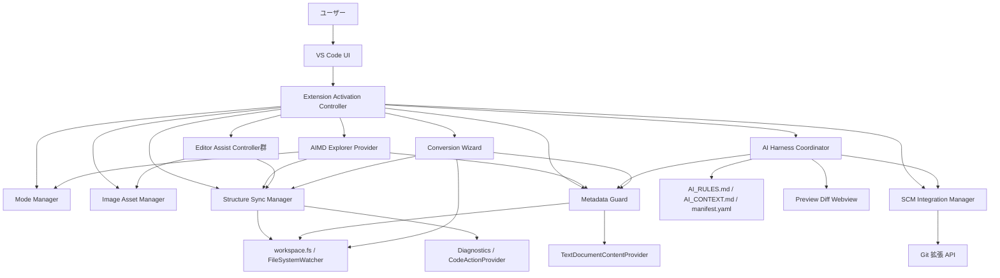
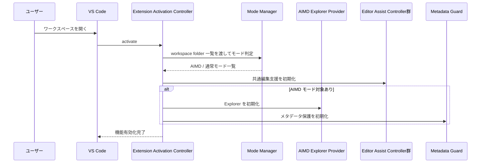
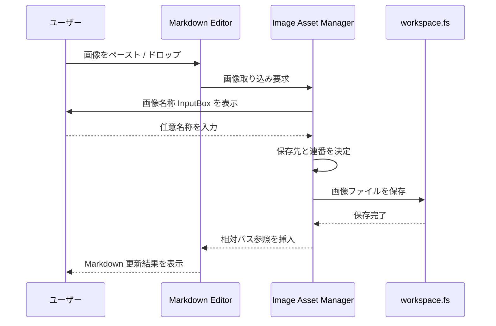
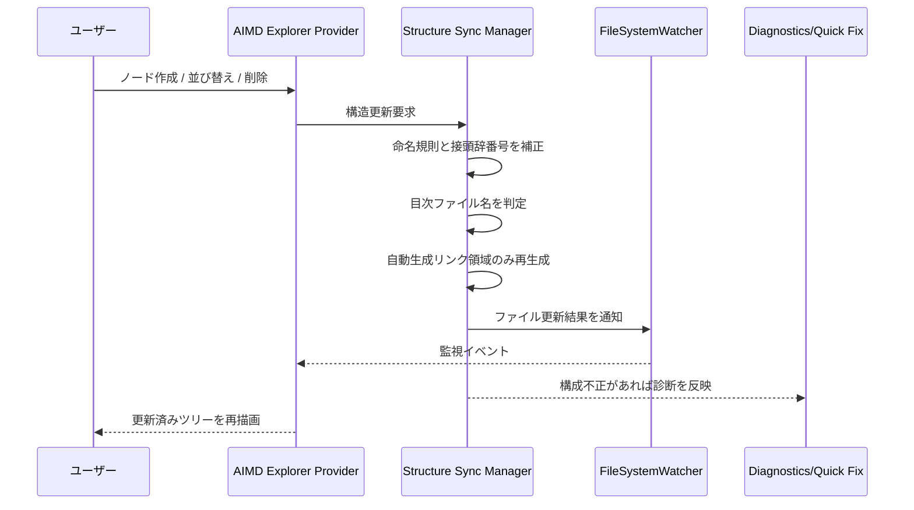
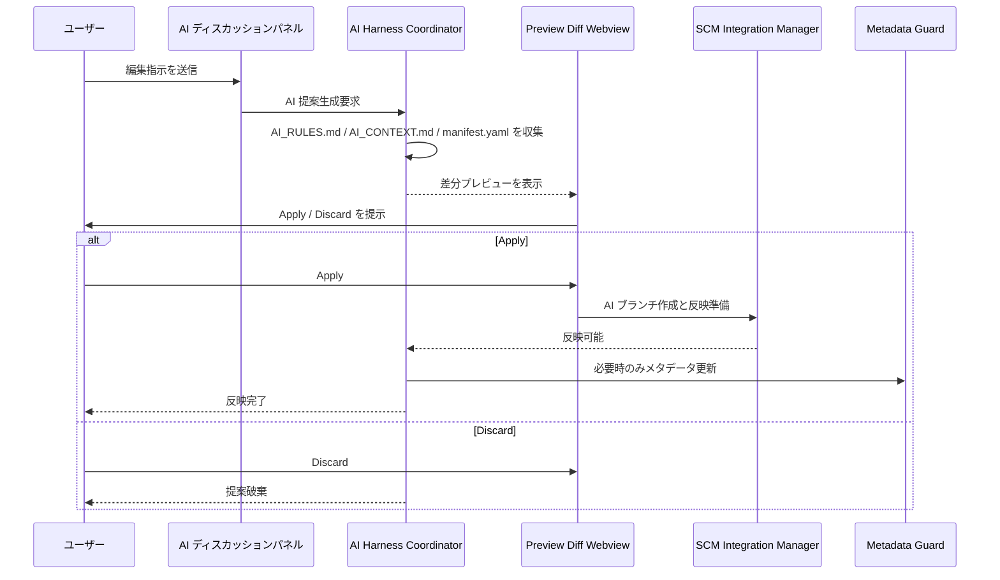
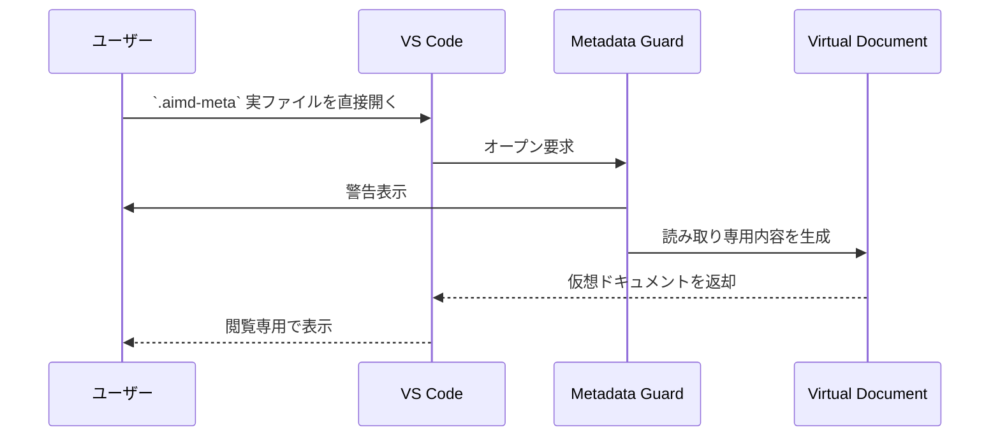
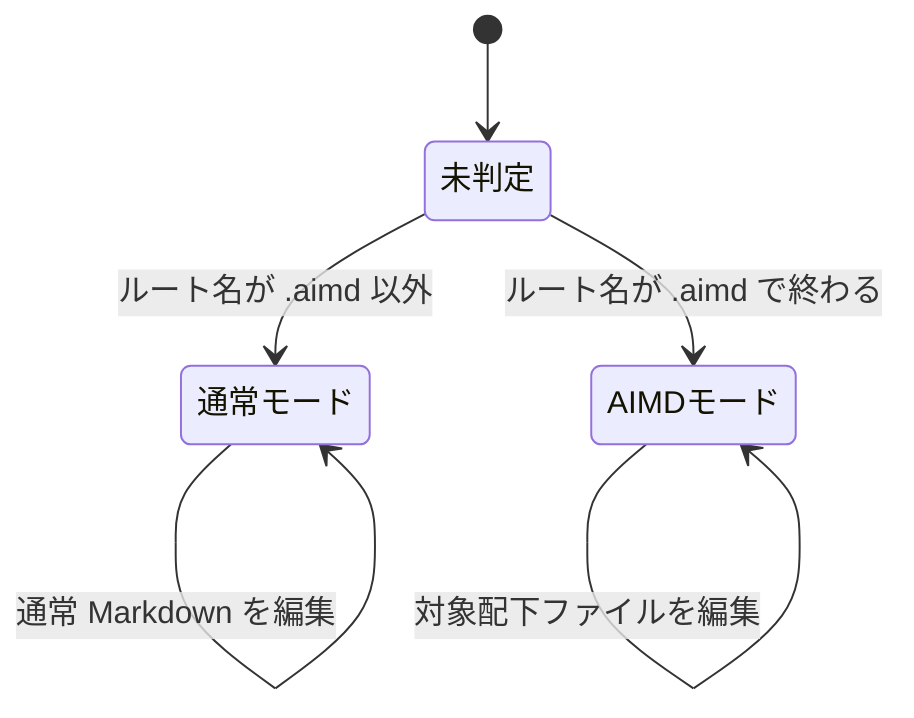
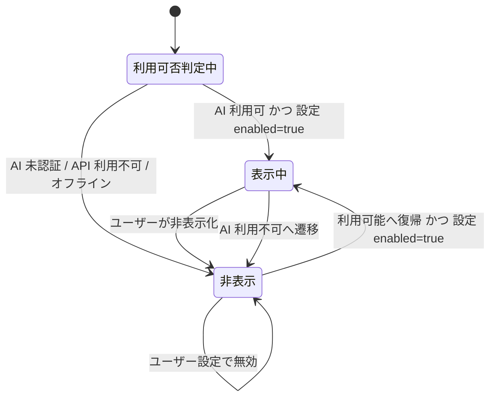
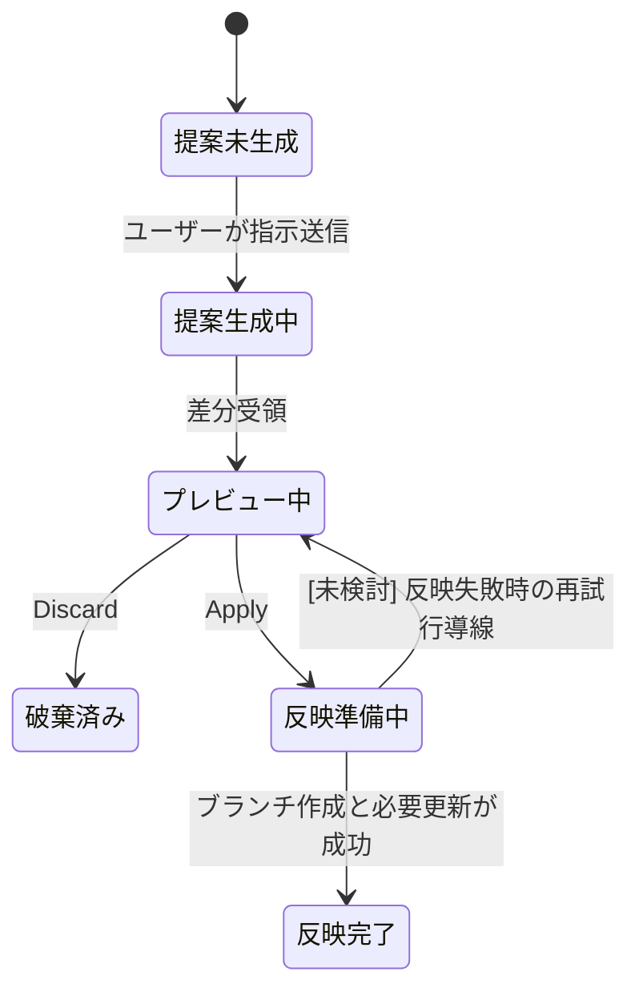
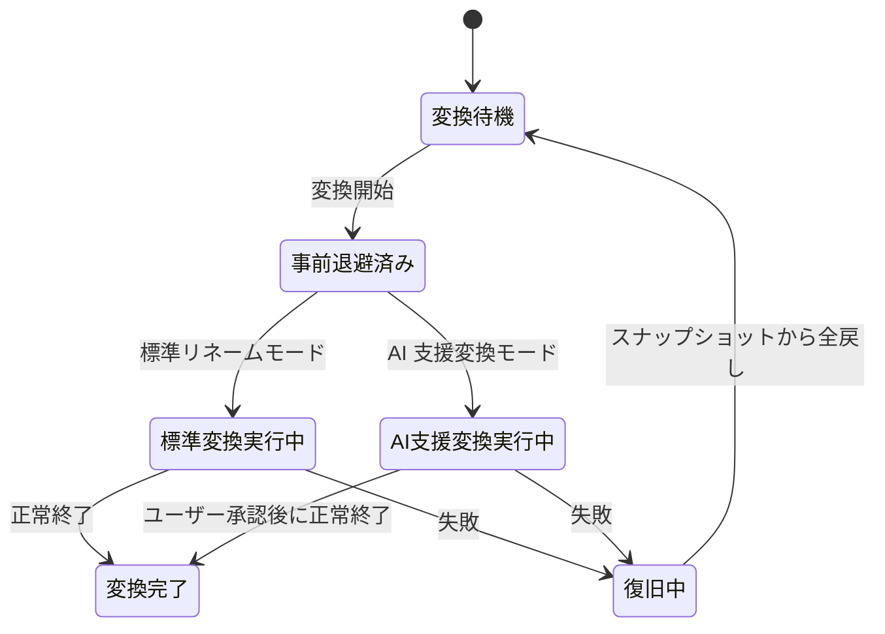

# 詳細設計書

## 1. 文書概要

| 項目 | 内容 |
| :--- | :--- |
| 文書名 | AIMD Studio 詳細設計書 |
| 対象 | VS Code 拡張機能「AIMD Studio」 |
| 目的 | 基本設計書に記載された機能を、実装単位・処理順序・状態変化の観点で分解する |
| 記載方針 | 基本設計書に明記された内容のみを根拠にし、関数名・引数・永続化形式など未確定事項は `[未検討]` とする |
| 参照元 | `03_基本設計・外部設計/基本設計書.md` |

- 本書では、基本設計書 8 章の「実装ディレクトリ案」を詳細設計の分解単位として採用する。
- 基本設計書に具体的な TypeScript の関数シグネチャは存在しないため、詳細設計では「処理単位」で責務・入出力・連携順を定義する。
- v1 の前提は「安全性と可逆性を優先し、AI 提案・AIMD 変換・SCM 反映はユーザー承認前提で適用する」とする。

## 2. 詳細設計対象と基本設計の対応

| 詳細設計単位 | 基本設計上の根拠 | 主な責務 |
| :--- | :--- | :--- |
| Extension Activation Controller (`src/extension.ts`) | 3.2 / 4.1 | 拡張機能起動、ワークスペース走査、機能初期化 |
| Mode Manager (`src/core/modeManager.ts`) | 3.2 / 4.1 / 6.2 | AIMD / 通常モード判定と状態保持 |
| AIMD Explorer Provider (`src/providers/aimdExplorerProvider.ts`) | 3.2 / 4.2 / 6.2 | AIMD ツリー生成、更新通知、保護表示 |
| Editor Assist Controller 群 (`src/providers/*.ts`) | 3.2 / 4.3 | スラッシュコマンド、テーブル編集、診断表示 |
| Image Asset Manager (`src/services/imageAssetService.ts`) | 3.2 / 4.4 / 6.2 | 画像保存先決定、採番、Markdown 参照挿入 |
| Structure Sync Manager (`src/services/tocSyncService.ts`) | 3.2 / 4.5 / 6.2 | 命名補完、目次同期、構成診断 |
| Metadata Guard (`src/services/metadataGuardService.ts`) | 3.2 / 4.6 / 7 | `.aimd-meta` の論理保護と復旧導線 |
| AI Harness Coordinator (`src/services/aiHarnessService.ts`) | 3.2 / 4.7 / 6.2 | AI コンテキスト生成、差分提案、Apply/Discard 制御 |
| SCM Integration Manager (`src/services/scmIntegrationService.ts`) | 3.2 / 4.8 | AI ブランチ作成、差分整理、コミット支援 |
| Conversion Wizard (`src/services/conversionWizardService.ts`) | 3.2 / 4.9 | AIMD 変換、スナップショット退避、失敗時復旧 |

## 3. コンポーネント関連図

## 4. 処理単位設計

### 4.1 起動・モード判定

| 処理単位 | 入力 | 処理 | 出力 |
| :--- | :--- | :--- | :--- |
| 拡張機能起動 | VS Code の `activate` 契機 | workspace folder 一覧を取得し、各機能の初期化順を制御する | モード別に有効化された機能群 |
| モード判定 | workspace folder 名 | 末尾が `.aimd` かを判定し、`WorkspaceMode` を生成する | `mode`, `rootPath` を持つ内部状態 |
| 共通機能初期化 | 起動結果 | Markdown 編集支援を全ワークスペースで有効化する | 編集補助機能の利用可能状態 |
| AIMD 固有機能初期化 | `WorkspaceMode=aimd` | Explorer、構成監視、メタデータ保護を対象ワークスペースへ紐付ける | AIMD 機能の利用可能状態 |

### 4.2 AIMD Explorer / 構造表示

| 処理単位 | 入力 | 処理 | 出力 |
| :--- | :--- | :--- | :--- |
| ツリー構築 | AIMD ルート配下のファイル・フォルダ | `.aimd-chapter` / `.aimd-section` / `.aimd-subsection` / `.md` / `99_Image` / `.aimd-meta` を表示対象としてノード化する | `AimdNode[]` |
| 表示順整列 | ノード一覧 | 接頭辞の連番順を基本に並び替える | 表示順付きノード |
| 保護表示 | `.aimd-meta` ノード | 鍵アイコンとグレーアウト表示を適用する | 保護表示済みノード |
| 再描画 | ファイル操作 / 監視イベント | ツリー更新通知を発火する | 更新済み Explorer |

### 4.3 Markdown 編集支援

| 処理単位 | 入力 | 処理 | 出力 |
| :--- | :--- | :--- | :--- |
| スラッシュコマンド候補提示 | 行頭または空行の `/` 入力 | Markdown 断片候補を提示する | 候補一覧 |
| スラッシュコマンド挿入 | ユーザー選択候補 | 選択された Markdown 断片を挿入する | 本文更新 |
| スマート改行 | Enter 入力 | GFM ハードブレイク用スペースを自動補完する | 改行後本文 |
| スタイル操作 | コマンド起点の選択 | インライン HTML を挿入する | 装飾済み本文 |
| テーブル編集 | Markdown テーブル編集中の操作 | 行列追加・削除・貼り付け変換を行う | 更新済みテーブル |

### 4.4 画像ハンドリング

| 処理単位 | 入力 | 処理 | 出力 |
| :--- | :--- | :--- | :--- |
| 画像取り込み受付 | ペースト / ドラッグ＆ドロップ | 入力経路差分を吸収し、単一の画像取り込み処理へ集約する | 画像データ |
| 画像名称受付 | InputBox 入力 | 任意名称を取得する | ラベル文字列 |
| 保存先決定 | 現在編集中の Markdown / モード | AIMD は `99_Image/`、通常モードは設定保存先を選定する | 保存先パス |
| 画像採番 | 対象 Markdown ファイル | ファイル単位で `fig01` から連番を払い出す | `ImageAssetInfo.sequence` |
| 参照挿入 | 保存済み画像パス | Markdown に相対パス参照を挿入する | 本文更新 |

### 4.5 構造同期・診断

| 処理単位 | 入力 | 処理 | 出力 |
| :--- | :--- | :--- | :--- |
| 命名補完 | ファイル・フォルダ作成操作 | 拡張子と命名規則を補完する | 正規化された名称 |
| 並び替え同期 | ドラッグ＆ドロップ並び替え | 接頭辞番号と目次リンクを同期更新する | 更新済み構造 |
| 目次生成・更新 | 構造変化 | `00_初めに.md` の有無に応じて `00_目次.md` または `01_目次.md` を更新する | 目次ファイル |
| 構成検査 | ワークスペース構造 | 構成不正を検出し、Diagnostics と Quick Fix を提示する | `ValidationIssue[]` |
| 自由記述保全 | 目次更新対象ファイル | 自動生成リンク領域のみ更新する | 自由記述を保持した目次 |

### 4.6 メタデータ保護 / AI / SCM / 変換

| 処理単位 | 入力 | 処理 | 出力 |
| :--- | :--- | :--- | :--- |
| メタデータ直接オープン抑止 | `.aimd-meta` 実ファイルの直接オープン | 警告表示後、読み取り専用仮想ドキュメントへ誘導する | 閲覧専用表示 |
| メタデータ更新 | AI による構成変更 | 保護サービス経由の内部書き込みのみ許可する | 更新済みメタデータ |
| AI コンテキスト生成 | AI 指示送信 | `AI_RULES.md`、`AI_CONTEXT.md`、`manifest.yaml` を収集する | AI 入力コンテキスト |
| AI 差分プレビュー | AI 応答 | Preview Diff で可視化し、Apply / Discard を待機する | `AiChangeSet` の保留状態 |
| SCM 反映準備 | Apply 要求 | AI ブランチを作成し、差分整理表示・コミット支援を行う | 反映可能状態 |
| 変換実行 | 変換コマンド | スナップショット退避後に標準変換または AI 支援変換を実行する | 変換結果 |
| 変換失敗復旧 | 変換中エラー | 実行前スナップショットから一括復元する | 復旧済み構成 |

## 5. 主要シーケンス図

### 5.1 拡張機能起動とモード判定

### 5.2 画像貼り付けから参照挿入まで

### 5.3 構造変更時の目次同期

### 5.4 AI 提案の生成から反映まで

### 5.5 `.aimd-meta` 直接編集の抑止

## 6. 状態遷移図

### 6.1 ワークスペースモード状態

### 6.2 AI ディスカッションパネル表示状態

### 6.3 AI 変更提案のライフサイクル

### 6.4 AIMD 変換のライフサイクル

## 7. 未確定事項

- TypeScript の具体的な関数名、引数、戻り値、例外方針は基本設計書に未記載のため `[未検討]` とする。
- `eventBus.ts` の採否は基本設計書 8 章で `[後回し]` とされているため、本書でも詳細化しない。
- Preview Diff Webview と AI ディスカッションパネルの画面部品粒度、入力フォーム項目、エラー表示文言は `[未検討]` とする。
- Git 拡張 API が利用できない場合のパッチエクスポート形式・保存先 UI は、基本設計書では方針のみ確定しているため詳細設計は `[未検討]` とする。

## 8. トレーサビリティ

| 本書の記載 | 参照した基本設計書の節 |
| :--- | :--- |
| 起動・モード判定 | 3.2, 4.1, 6.2 |
| AIMD Explorer | 3.2, 4.2, 6.2 |
| Markdown 編集支援 | 3.2, 4.3 |
| 画像ハンドリング | 3.2, 4.4, 6.2 |
| 構造同期・目次更新 | 3.2, 4.5, 6.2 |
| メタデータ保護 | 3.2, 4.6, 7 |
| AI 連携 | 3.2, 4.7, 6.2, 7 |
| Git / SCM 連携 | 3.2, 4.8 |
| AIMD 変換ウィザード | 3.2, 4.9 |

## 9. 開発・デバッグ環境設計

| 設定ファイル | 目的 | 設計内容 |
| :--- | :--- | :--- |
| `05_実装/package.json` | 拡張機能マニフェスト定義 | `main` を `dist/extension.js` とし、`compile` / `watch` / `typecheck` スクリプトでビルド経路を統一する |
| `05_実装/.vscode/launch.json` | Extension Host 起動 | `Launch Extension` 構成で `--extensionDevelopmentPath=${workspaceFolder}/05_実装` を指定し、`dist/**/*.js` をデバッグ対象にする |
| `05_実装/tsconfig.json` | TypeScript デバッグ性確保 | `sourceMap: true` を有効化し、TypeScript ソースに対するブレークポイント解決を可能にする |
